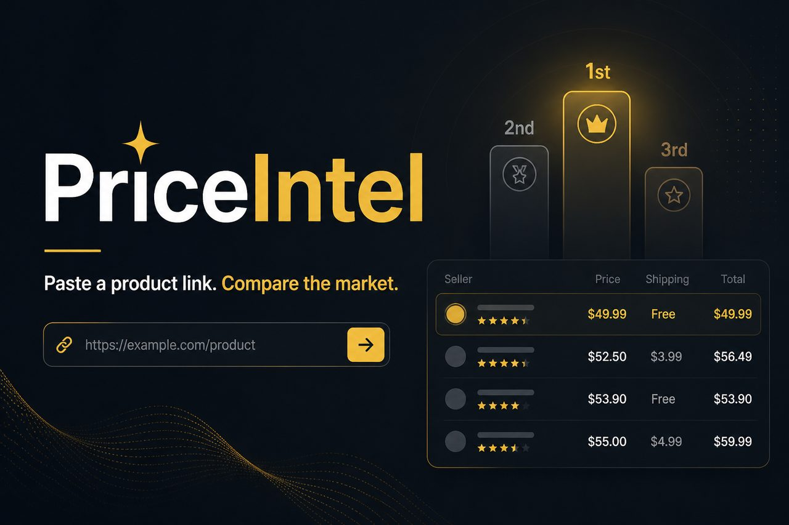
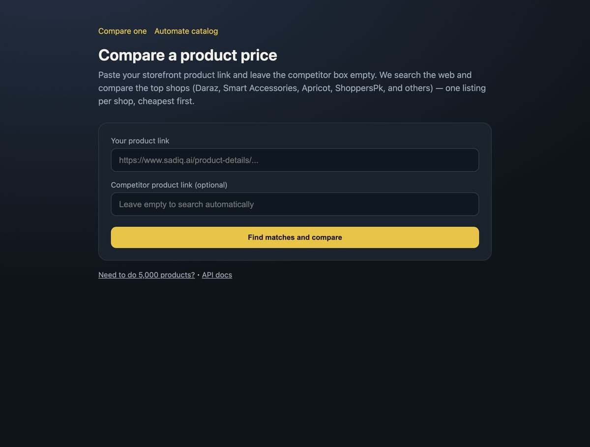
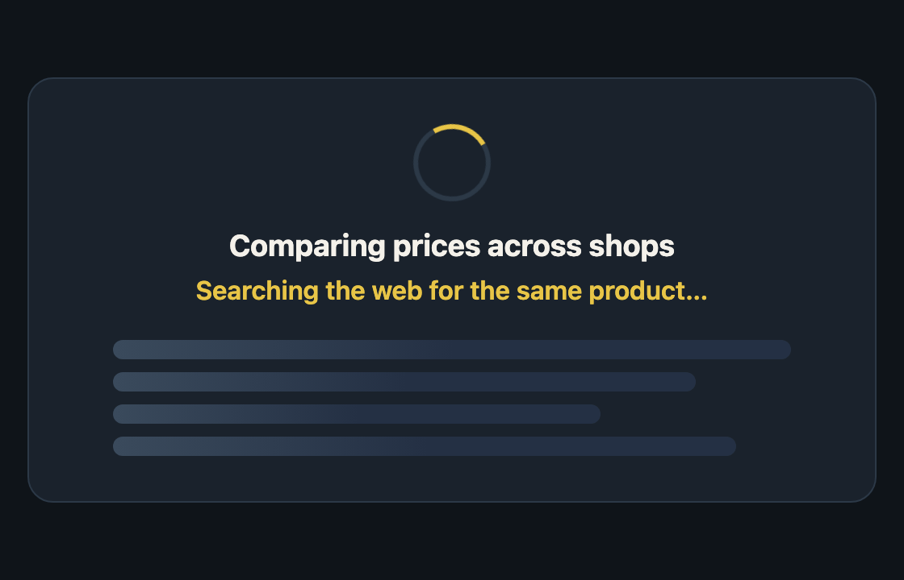
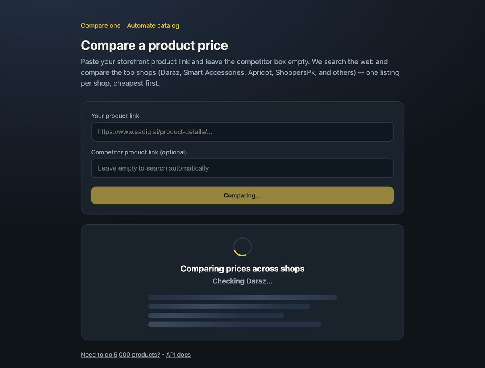
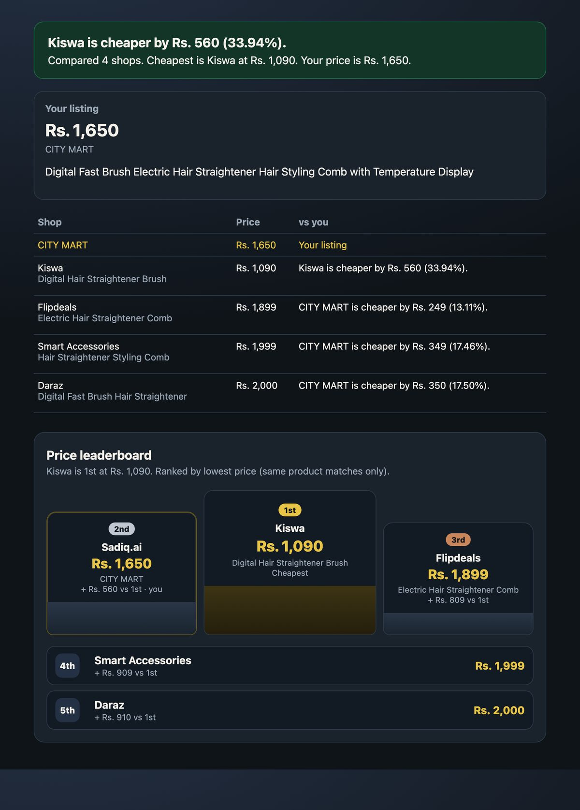
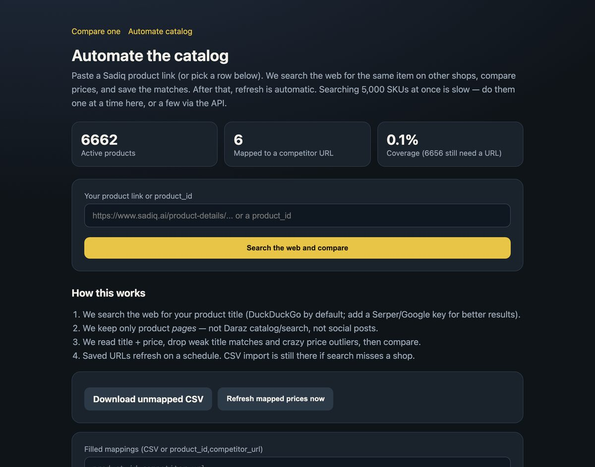
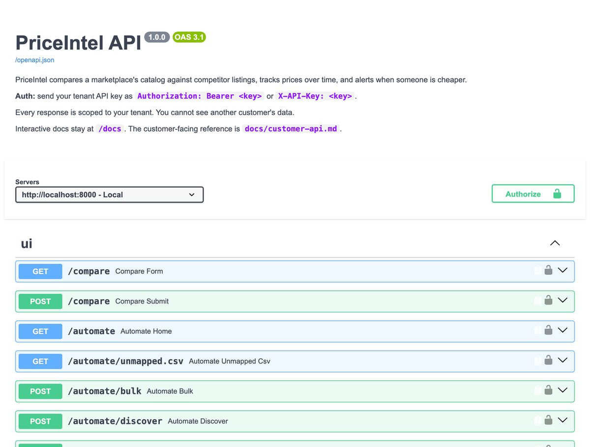

<p align="center">
  
</p>

<h1 align="center">PriceIntel</h1>

<p align="center">
  <strong>Paste one product URL → search the web → rank shops by price.</strong><br/>
  Multi-tenant price intelligence for marketplaces (first tenant: Sadiq.ai).
</p>

<p align="center">
  <a href="http://localhost:8000/compare">Compare UI</a> ·
  <a href="http://localhost:8000/docs">API docs</a> ·
  <a href="docs/customer-api.md">Customer API</a> ·
  <a href="docs/technical-doc.md">Architecture</a>
</p>

<p align="center">
  
  
  
  
  
</p>

---

## What it does

| Step | Result |
|------|--------|
| 1. Paste your storefront product link | Catalog title + **sale price** (discount aware) |
| 2. Leave competitor empty | Web search finds product pages (Daraz, Homducts, Kiswa, …) |
| 3. Match + scrape | Weak titles & crazy prices dropped |
| 4. Compare | Table + **1st–5th price leaderboard** (Sadiq included) |

---

## Screenshots

### Paste a link

<p align="center">
  
</p>

### Live search animation

<p align="center">
  
</p>

<p align="center">
  
</p>

### Results + leaderboard (1st → 5th)

<p align="center">
  
</p>

### Bulk automate & API

<p align="center">
  
</p>

<p align="center">
  
</p>

---

## Quick start

```bash
cp .env.example .env          # fill Mongo, TENANT_API_KEY, ADMIN_API_KEY
python3 -m venv .venv
source .venv/bin/activate
pip install -r requirements.txt
playwright install chromium
docker compose up -d          # Redis
uvicorn app.main:app --reload
```

Open:

- **Compare UI** → http://localhost:8000/compare  
- **Health** → http://localhost:8000/health  
- **Swagger** → http://localhost:8000/docs  

Paste a Sadiq `product-details` URL, leave the competitor box empty, hit **Find matches and compare**.

---

## Environment (must-haves)

| Variable | Purpose |
|----------|---------|
| `CATALOG_MONGO_URI` / `CATALOG_DB_NAME` | Tenant catalog (read-only preferred) |
| `PRICEINTEL_MONGO_URI` / `PRICEINTEL_DB_NAME` | Matches, history, tenants (`price_intel`) |
| `TENANT_API_KEY` | Customer `Authorization: Bearer` |
| `ADMIN_API_KEY` | Onboard tenants only |
| `REDIS_URL` | Celery / queue (`redis://localhost:6379/0` locally) |

Optional: `SERPER_API_KEY` (better PK search), SMTP for alerts. See [`.env.example`](.env.example).

Sale price: if catalog `after_discount` is stale but `discount` % is set, PriceIntel applies the % (e.g. Rs. 1000 − 21% → **Rs. 790**).

---

## Deploy (Railway)

This repo includes a production `Dockerfile` + `railway.toml`.

1. Push to GitHub → Railway **Deploy from GitHub**
2. Add **Redis** → set `REDIS_URL` via variable reference
3. Paste the rest of `.env` into service Variables
4. **Settings → Networking → Generate Domain** (port `8080` / `$PORT`)
5. Visit `https://YOUR-DOMAIN/compare`

Optional workers (same image, different start command):

```bash
celery -A app.tasks.celery_app worker --loglevel=info
celery -A app.tasks.celery_app beat --loglevel=info
```

> Tip: Railway runs in a US region — free DuckDuckGo/Yahoo results can differ from local PK. Add `SERPER_API_KEY` for stabler Google-PK style discovery.

---

## API cheatsheet

```bash
export KEY='<TENANT_API_KEY>'

curl -s http://localhost:8000/v1/me -H "Authorization: Bearer $KEY"

curl -s -X POST http://localhost:8000/v1/automation/discover \
  -H "Authorization: Bearer $KEY" \
  -H "Content-Type: application/json" \
  -d '{"storefront_url":"https://www.sadiq.ai/product-details/..."}'
```

More: [`docs/customer-api.md`](docs/customer-api.md)

---

## Project layout

```
app/
  api/           # REST + /compare + /automate UI
  catalog/       # Field map (sale price / discount %)
  scrapers/      # Daraz + generic Playwright fetchers
  services/      # discovery, web_search, matching, scrape
  tasks/         # Celery jobs
Dockerfile       # API + Chromium for Railway
railway.toml
```

---

## Matching without Mongo

```bash
python scripts/demo_matching.py
```

Peek catalog schema:

```bash
python scripts/inspect_catalog.py
```

---

## License

Proprietary — Sadiq.ai / PriceIntel.
